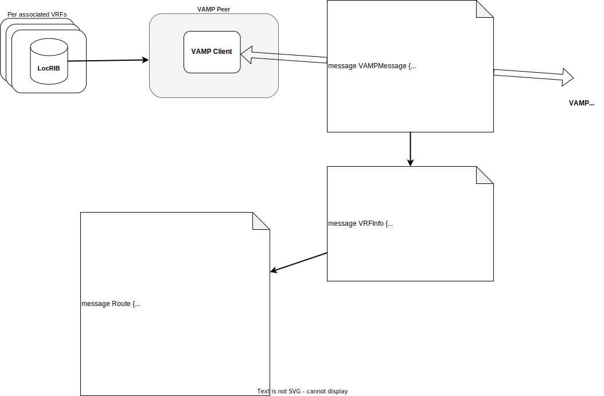

# VRF-Aware Monitoring Protocol (VAMP)

This protocol is designed to allow leveraging Bio-Routing to observe routing information present inside the network, across multiple VRFs and protocols.

Now you may wonder, that this sound similar to the BGP Monitoring Protocol (BMP), and it is, but it's also different in some aspects:

 * BMP has support to expose routing information from different VRFs, which are identified by their respective Route Distinguisher (RD). To be able to leverage this feature there needs to be a unique RD per VRF, which introduces the requirement to managed RDs per VRF or device. When dealing with VRF-lite setups managing RDs would otherwise not be required and therefore it may not be desireable to add this additional requirement into the overall architecture.
 * BMP only exposes routes learned via BGP - which is was designed to do - in some circumstances however it might be desireable to also expose routing information from other protocols like IS-IS, OSPF, or even static routes, which may have been added manually or programatically.

To be most flexible the VRF-Aware Monitoring Protocol allows exporting routes for multiple VRFs over one gRPC connection.

Bio-Routing, at least for now, only implements a VRF-Aware Monitoring Protocol client componenent, meaning that the user has to run a VAMP server by themselves. An example can be found in the examples/vamp/ folder inside this repository.

The following diagram shows the architectural overview:

